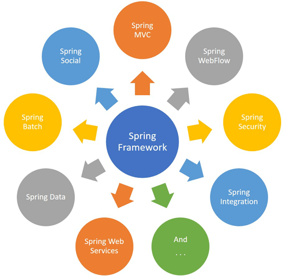

1. 프레임워크란 : SW, Application 개발을 간단하게 햊주는 뼈대  
 - 장점 : 모든 기능을 제공해서 개발 시간과 비용을 줄임  
 - 단점 : 고유의 사용법 이해가 필요  

2. 스프링 프레임워크란 : 자바 개발 환경의 프레임워크  
 - Spring Data : 데이터 접근에 관한 기능을 제공  
 - Spring MVC  : 웹 애플리케이션을 간단하게 생성하는 기능 제공  
 - Spring Batch  : 배치 처리 기능을 제공  
 - Spring Security : 인증/허가 기능 제공  
 - Spring DI : 의존성 주입 기능 제공  
 - Spring AOP : 관점 지향 프로그래밍 기능 제공  

 3. JDK, IDE, PostgreSQL 설정
  - JDK : BellSoft Liberica JDK 11  
  - IntelliJ IDEA Ultimate  
  - RDBMS 기반 PostgreSQL  
  
  
목표 : 매주 꾸준하게 스프링에 대해 이해를 하고 성실한 개발자가 되어야겠다.  
